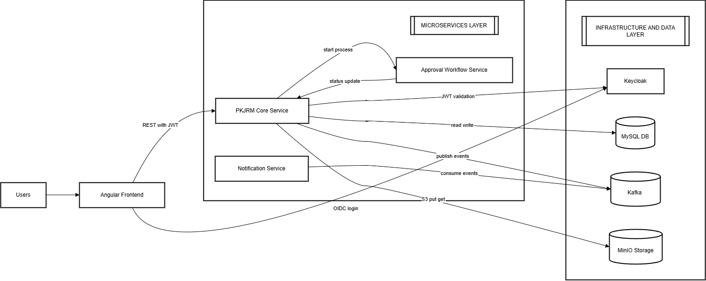
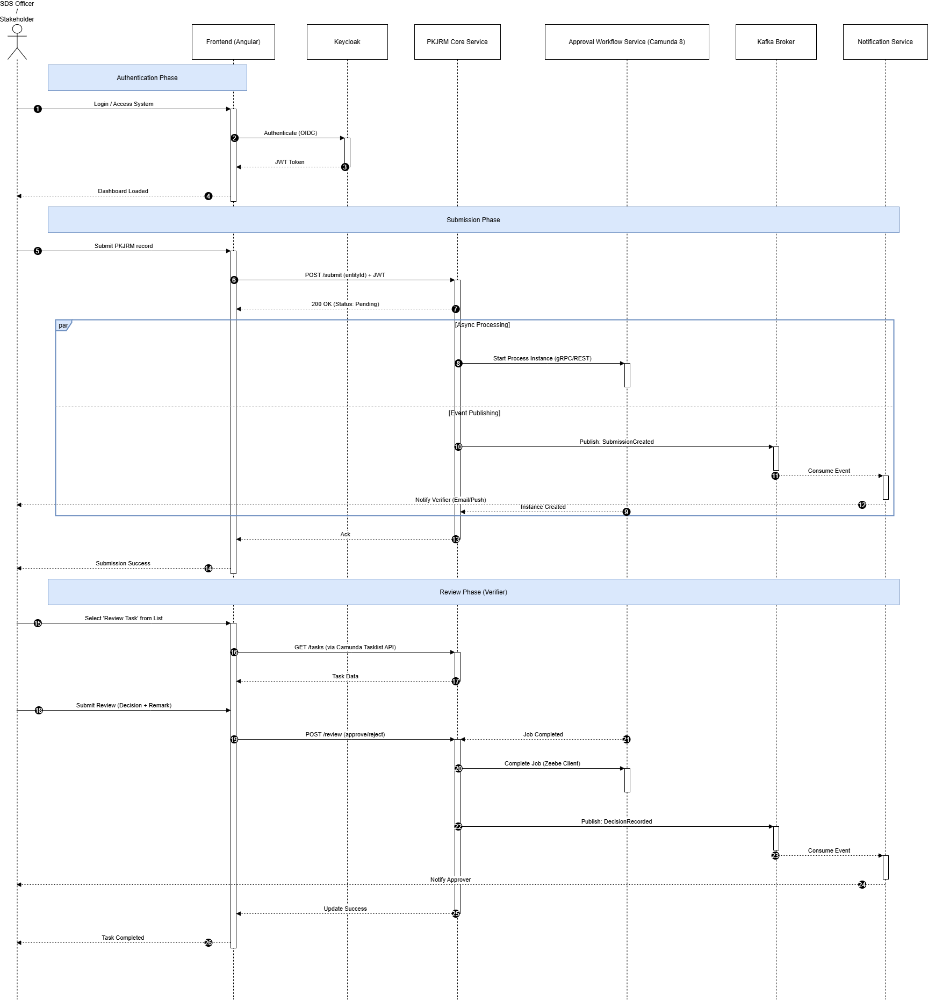
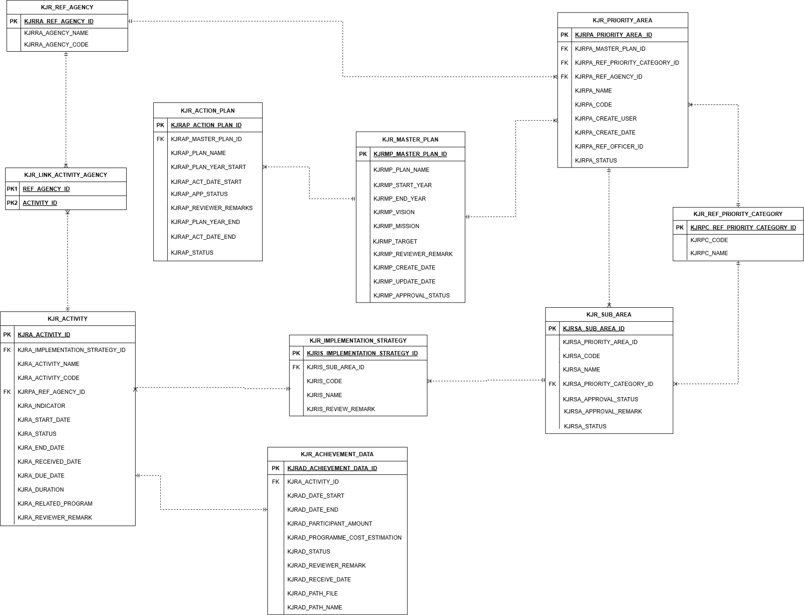

# Strategic Plan Monitoring System (Industry-Led Proof of Concept)

## Overview

The Strategic Plan Monitoring System is a workflow-driven monitoring platform developed as an industry-led Proof of Concept (PoC). It demonstrates how structured governance and performance tracking can be digitized using modular backend architecture and event-driven communication patterns.

The system supports hierarchical strategic planning, progress tracking, evidence submission, and multi-stage workflow approvals within a secure, role-based environment.

> Note: Source code is not publicly available due to confidentiality. This repository documents the system architecture, design decisions, and technical implementation approach.

---

## Problem Statement

Traditional governance and monitoring systems often struggle with:

- Manual and fragmented tracking processes  
- Limited visibility into approval workflows  
- Poor auditability and traceability  
- Tight coupling between system modules  
- Limited scalability for growing organizational needs  

This project demonstrates how modular backend services, workflow orchestration, and asynchronous messaging can address these challenges in a structured and scalable manner.

---

## High-Level Architecture

### Core Components

- **Backend Service (Spring Boot)**  
  Implements REST APIs, business logic, and structured data persistence.

- **Workflow Engine (Camunda 8)**  
  Manages approval processes, task assignments, and state transitions.

- **Event Communication (Apache Kafka)**  
  Enables asynchronous notifications and service decoupling.

- **Authentication & Authorization (OAuth2 / OIDC via Keycloak)**  
  Provides secure, role-based access control.

- **Frontend (Angular)**  
  Delivers user interfaces for plan submission, tracking, and workflow interaction.

- **Database (MySQL)**  
  Stores domain entities and workflow-related metadata.

- **Containerization (Docker)**  
  Ensures consistent and portable deployment environments.

---

## System Workflow

### High-Level Flow

1. A user submits strategic plan data via the Angular frontend.
2. The backend validates and persists structured domain entities.
3. The workflow engine initiates an approval process.
4. Kafka events are published to trigger asynchronous notifications.
5. Role-based users complete assigned workflow tasks.
6. Final approval updates system state and audit records.

---

## Backend Architecture Design

### Design Principles

- Layered architecture (Controller → Service → Repository)
- Clear separation of domain and workflow state
- DTO-based API contracts
- Strong service encapsulation
- Event-driven communication for decoupling and scalability

This approach ensures maintainability, extensibility, and structured service boundaries.

---

## Event-Driven Communication Model

Apache Kafka is used to:

- Publish workflow state changes
- Trigger notification and downstream processing
- Decouple domain logic from auxiliary services
- Improve scalability and fault isolation

This design reduces tight coupling and improves system resilience.

---

## Data Model Overview

The relational model supports:

- Hierarchical strategic planning structures
- Workflow state tracking
- Evidence metadata management
- Role-based user associations

The schema design emphasizes normalization, traceability, and structured governance relationships.

---

## Technology Stack

### Backend
- Java
- Spring Boot
- Spring Data JPA
- Hibernate

### Workflow & Messaging
- Camunda 8
- Apache Kafka

### Security
- OAuth2
- OpenID Connect (OIDC)
- Keycloak

### Frontend
- Angular
- TypeScript

### Database
- MySQL

### Infrastructure
- Docker

---

## Engineering Focus

This project demonstrates practical experience in:

- Modular backend architecture
- RESTful API design
- Workflow orchestration integration
- Event-driven system design
- Role-based access control implementation
- Containerized deployment strategy

---

## Learning Outcomes

- Designing scalable backend systems
- Structuring workflow-driven business processes
- Applying asynchronous messaging patterns
- Implementing secure authentication flows
- Maintaining clean and modular service architecture

---

## Future Improvements

- Horizontal service scaling
- Observability (metrics, logging, tracing)
- Cloud-native deployment strategies
- Performance benchmarking and load testing

---

## Disclaimer

This repository documents the architectural design and technical implementation approach of an industry-led Proof of Concept system. Source code and business logic are not publicly shared due to confidentiality constraints.
